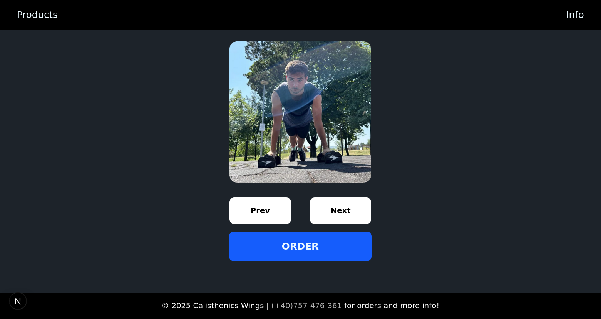
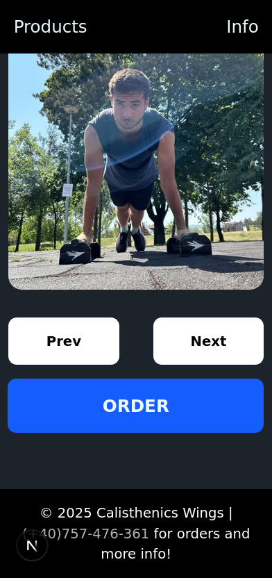

# Cota Alexandru's Blog

## Table of Contents

- [Overview](#overview)
  - [Screenshot](#screenshot)
- [My Process](#my-process)
  - [What I Learned](#what-i-learned)
  - [Continued Development](#continued-development)
  - [My Tech Stack](#my-tech-stack)
  - [Useful Resources](#useful-resources)

## Overview

### Screenshot

  
  

---

## My Process

### What I Learned

🎯

- How to use SendGrid API to send email message to both user(connected via Google) and the owner of the product.
- If you take a finished project, then modify it quite much, then you should delete the backend, and other components that you don't want(don't work yet)

---

### Continued Development

🔥

- I am going to deploy Wings, My Platform and Blog successfully, without any misconfigurations.
- Making these 3 projects future versions and more clean!

### My Tech Stack

💡

- **Frontend:** Next.js, React, TypeScript
- **Styling & UI:** Tailwind CSS with Shadcn, Daisy UI, Framer Motion, Magic UI
- **Backend & Database:** Prisma, PostgreSQL
- **Testing & Validation:** Vitest, Jest, Testing Library, Zod

Staying consistent and improving my skills with these technologies is my top priority! 🚀

---

### Useful Resources

📚

| Resource Name                     | Description                                                                                | Link                                                      |
| --------------------------------- | ------------------------------------------------------------------------------------------ | --------------------------------------------------------- |
| **Vitest Documentation**          | Official documentation for Vitest testing framework.                                       | [Vitest Docs](https://vitest.dev/)                        |
| **TypeScript Documentation**      | Comprehensive guide on TypeScript language features and best practices.                    | [TypeScript Docs](https://www.typescriptlang.org/docs/)   |
| **Tailwind CSS v4 Documentation** | Official documentation for Tailwind CSS version 4, including utilities and configurations. | [Tailwind CSS v4 Docs](https://tailwindcss.com/)          |
| **Framer Motion Documentation**   | Detailed documentation for the Framer Motion library for animations.                       | [Framer Motion Docs](https://www.framer.com/motion/)      |
| **React Documentation**           | Official React documentation covering concepts, hooks, and advanced patterns.              | [React Docs](https://react.dev/)                          |
| **Next.js Documentation**         | Official Next.js documentation covering routing, API routes, and optimizations.            | [Next.js Docs](https://nextjs.org/docs)                   |
| **MongoDB Documentation**         | Official MongoDB documentation for database setup, queries, and best practices.            | [MongoDB Docs](https://www.mongodb.com/docs/)             |
| **Express.js Documentation**      | Guide on using Express.js to build backend APIs with Node.js.                              | [Express.js Docs](https://expressjs.com/)                 |
| **Node.js Documentation**         | Official Node.js documentation for backend development.                                    | [Node.js Docs](https://nodejs.org/en/docs/)               |
| **Jest Documentation**            | Comprehensive guide on testing with Jest, useful for unit and integration testing.         | [Jest Docs](https://jestjs.io/docs/getting-started)       |
| **Testing Library Documentation** | Guide on using React Testing Library for writing accessible tests.                         | [Testing Library Docs](https://testing-library.com/docs/) |
| **Zod Documentation**             | Schema validation library useful for Next.js and TypeScript projects.                      | [Zod Docs](https://zod.dev/)                              |

---

🚀 Happy coding!
